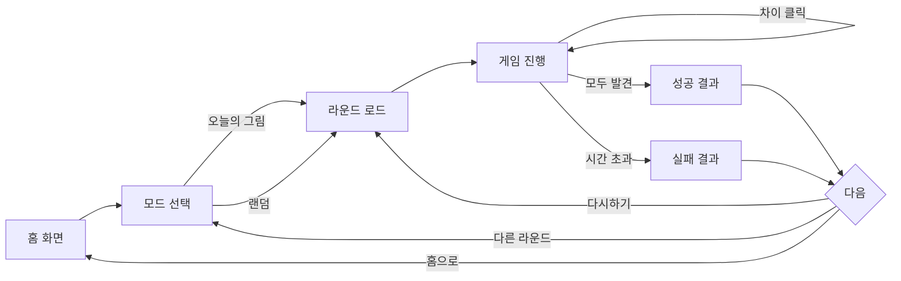

# 02. 게임 디자인

## 2.1 코어 루프



## 2.2 룰

- 한 라운드는 **5개의 차이점**을 기본으로 한다. (콘텐츠 메타에서 N으로 가변)
- 제한 시간: 기본 60초. 콘텐츠 메타의 `time_limit_sec`로 오버라이드 가능.
- **정답 판정**: 클릭(또는 탭) 좌표가 미리 정의된 차이 영역(원형 hit-box)에 들어가면 정답.
  - 좌표는 0~1 정규화 비율 (이미지 해상도 무관)
  - hit-box는 `(cx, cy, r)` 원, 모바일 기본 r=0.05 (이미지 폭의 5%)
- **오답 페널티**: 잘못 클릭 시 1초 차감 (선택). MVP는 시각적 흔들림만, 페널티 0.
- **종료 조건**:
  - 모든 차이 발견 → 성공, 남은 시간 점수화
  - 시간 0 → 실패
  - 사용자 "포기" 버튼 → 실패로 처리
- **점수**: `남은 시간 * 100 + 콤보 보너스`. MVP는 단순 표시만, 저장 안 함.

## 2.3 화면 구성

### 2.3.1 홈 화면

```
┌──────────────────────────────┐
│         🍞 Twin Toast          │
│   다른 그림 찾기 · 60초 도전     │
│                              │
│   [ 오늘의 그림 ]              │
│   [   랜덤 시작   ]            │
│                              │
│   하단: 콘텐츠 N개 · v0.1     │
└──────────────────────────────┘
```

- 텍스트 ≤ 3줄, CTA 버튼 2개. 그 외 요소 없음.
- 다크/라이트 모드 자동 (`prefers-color-scheme`).

### 2.3.2 게임 화면

```
┌──────────────────────────────┐
│  ⏱ 0:42        ★ 2 / 5         │
│  ──────────  남은 시간 게이지   │
│                              │
│   ┌───────────┐ ┌───────────┐ │
│   │           │ │           │ │
│   │  IMG L    │ │  IMG R    │ │
│   │           │ │           │ │
│   └───────────┘ └───────────┘ │
│                              │
│   [ 포기 ]   [ ⓘ 신고 ]        │
└──────────────────────────────┘
```

**모바일 (≤ 768px)**: 두 이미지를 세로로 쌓는다. 위/아래 배치.
**데스크톱**: 가로 배치, 양쪽 이미지 고정 비율 1:1.

차이를 발견하면 **양쪽 이미지에 동시에 원형 마커**를 표시한다 (정답 좌표 ↔ 미러).

### 2.3.3 결과 화면

- 성공: 점수 + "🎉 클리어!" + 정답 5개 표시 + [다시 / 다음 / 홈]
- 실패: "⏰ 시간 종료" + 발견한 정답 표시 + 못 찾은 차이 자동 하이라이트 + [다시 / 다음 / 홈]

## 2.4 입력 처리

| 디바이스 | 입력 |
|----------|------|
| 모바일 | 단일 탭 (멀티터치 무시) |
| 데스크톱 | 마우스 좌클릭 |
| 키보드 | Tab으로 이미지 포커스, Space/Enter로 가상 커서 클릭 — MVP에서는 보너스 |

- 이미지 위에 **포지션 락**이 걸린 transparent overlay (`<button>` 또는 `<div role="button">`).
- 좌표는 `getBoundingClientRect`로 얻고 normalize.
- pinch-zoom 비활성화? **금지**. 사용자가 확대해서 보는 경험은 핵심이다. 단, 더블탭 줌은 막는다.

## 2.5 상호작용 디테일

- 정답 클릭: 마커 페이드인 + 짧은 반짝임 + 효과음 (선택, 기본 ON)
- 오답 클릭: 클릭 위치에 1초간 X 표시 + 흔들림 애니메이션 (60ms)
- 시간 ≤ 10초: 시계 빨갛게 + 살짝 박동
- 결과 화면 진입: 200ms fade

## 2.6 사운드

- BGM 없음 (즉시성 우선)
- SFX 3종: 정답 / 오답 / 라운드 종료
- 음원은 무료 라이선스 (예: Kenney UI pack), `public/sfx/`에 호스팅
- 첫 사용자 입력 전까지는 음소거 (브라우저 자동재생 정책)

## 2.7 접근성

- 색상 대비: 마커는 콘텐츠와 무관하게 보이도록 외곽선 + 채도 높은 색
- 모션 감소(`prefers-reduced-motion`): 흔들림/박동 비활성
- 텍스트 크기는 rem 단위, 사용자 줌 허용
- 대체 텍스트: 이미지에는 의미 있는 alt (콘텐츠 메타에서 가져옴)
