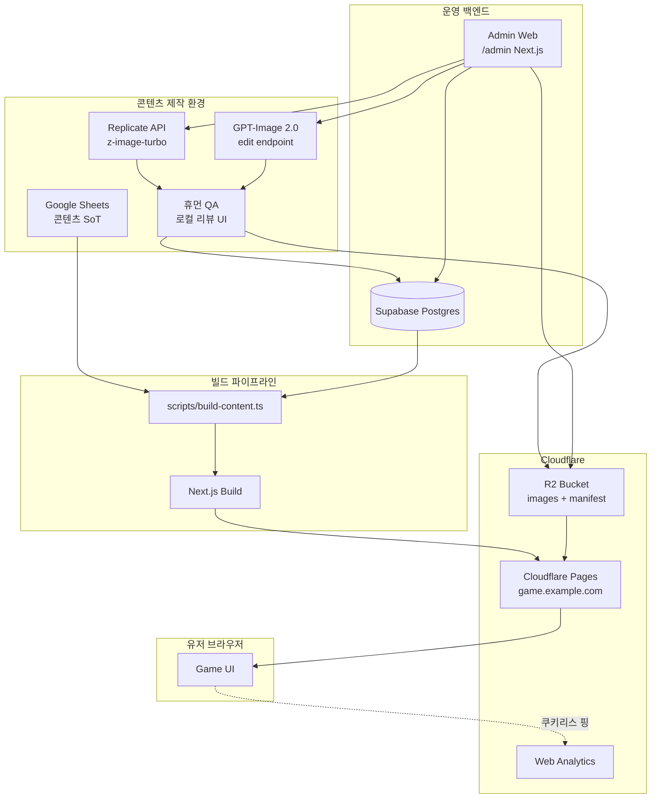
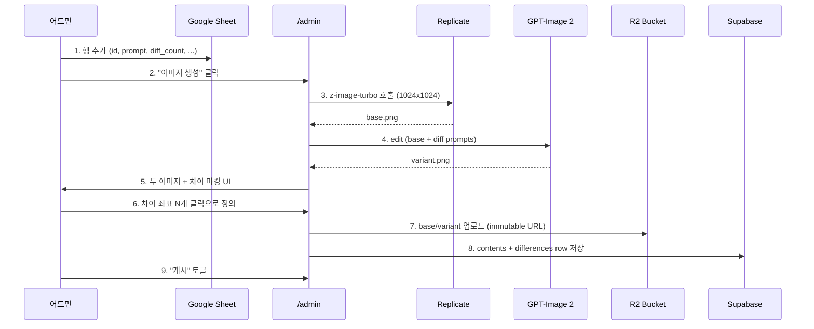
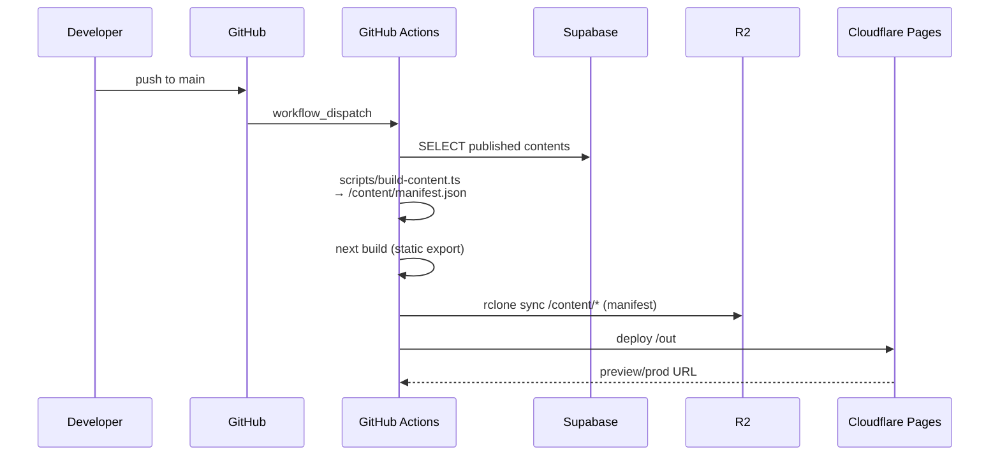
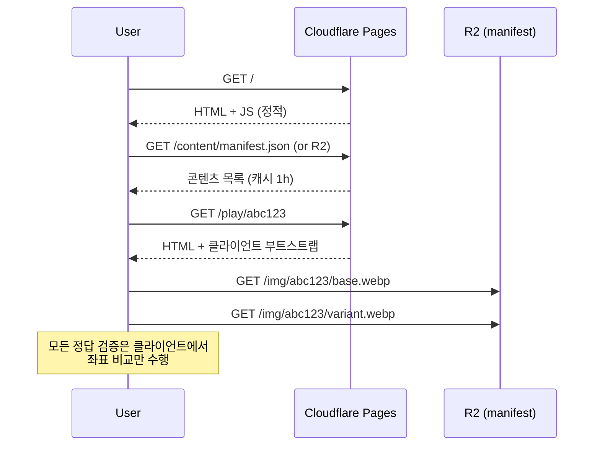

# 04. 시스템 아키텍처

## 4.1 컴포넌트 다이어그램



## 4.2 데이터 흐름

### 4.2.1 콘텐츠 추가 (오프라인)



### 4.2.2 빌드 & 배포



> **메모**: manifest.json은 R2에도 올리지만 1차로는 Pages 정적 자산으로 함께 배포한다 (CDN HIT 빠름). R2는 어드민이 *빌드 없이* 콘텐츠를 push할 때를 위한 fallback/Remote Config 채널.

### 4.2.3 런타임 (게임 실행)



## 4.3 환경 분리

| 환경 | 도메인 | Supabase | R2 버킷 | 용도 |
|------|--------|----------|---------|------|
| local | localhost:3000 | local Supabase or staging | `twin-toast-dev` | 개발 |
| preview | `*.pages.dev` | staging | `twin-toast-dev` | PR preview |
| production | `twintoast.app` | production | `twin-toast-prod` | 출시 |

`.env.local` 키:

```
NEXT_PUBLIC_R2_BASE_URL=https://cdn.twintoast.app
NEXT_PUBLIC_MANIFEST_URL=https://cdn.twintoast.app/manifest/v1.json
SUPABASE_URL=...                # 서버/빌드 전용
SUPABASE_SERVICE_ROLE_KEY=...   # 서버/빌드 전용 (CI secret)
REPLICATE_API_TOKEN=...         # 어드민 전용
OPENAI_API_KEY=...              # 어드민 전용 (GPT-Image)
```

게임 클라이언트는 `NEXT_PUBLIC_*`만 사용한다. 다른 키가 클라이언트에 노출되면 빌드 실패하도록 ESLint custom rule을 둔다.

## 4.4 캐시 전략

| 자원 | 캐시 정책 | 무효화 |
|------|-----------|--------|
| HTML | `cache-control: public, max-age=0, must-revalidate` | 배포 시 즉시 |
| JS/CSS (해시 파일명) | `immutable, max-age=31536000` | 파일명 변경 |
| 이미지 (R2, 해시 경로) | `immutable, max-age=31536000` | 경로 변경 |
| manifest.json | `public, max-age=300, s-maxage=3600` | 의도적으로 짧게 — Remote Config 효과 |
| sfx | `immutable, max-age=31536000` | |

manifest.json만 짧게 캐시하는 이유: 어드민이 새 콘텐츠를 게시하면 *빌드 없이* CDN purge로 반영 가능. 자세한 전략은 `07_content_ops.md`.
