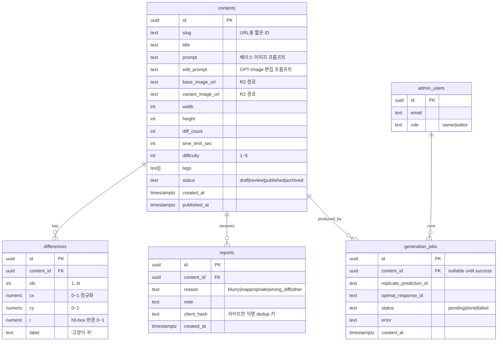

# 05. 데이터 모델

## 5.1 Supabase 스키마



### DDL 초안

```sql
create table contents (
  id uuid primary key default gen_random_uuid(),
  slug text unique not null,
  title text not null,
  prompt text not null,
  edit_prompt text not null,
  base_image_url text not null,
  variant_image_url text not null,
  width int not null default 1024,
  height int not null default 1024,
  diff_count int not null,
  time_limit_sec int not null default 60,
  difficulty smallint not null check (difficulty between 1 and 5),
  tags text[] not null default '{}',
  status text not null default 'draft'
    check (status in ('draft','review','published','archived')),
  created_at timestamptz not null default now(),
  published_at timestamptz
);

create table differences (
  id uuid primary key default gen_random_uuid(),
  content_id uuid not null references contents(id) on delete cascade,
  idx int not null,
  cx numeric not null check (cx between 0 and 1),
  cy numeric not null check (cy between 0 and 1),
  r  numeric not null check (r  between 0 and 0.3),
  label text,
  unique (content_id, idx)
);

create table reports (
  id uuid primary key default gen_random_uuid(),
  content_id uuid references contents(id) on delete set null,
  reason text not null,
  note text,
  client_hash text,
  created_at timestamptz not null default now()
);

-- RLS
alter table contents enable row level security;
alter table differences enable row level security;
alter table reports enable row level security;

-- 게임 클라이언트는 DB 접근 안 함. read policy 없음.
-- 어드민은 service_role로 접근. (Auth + custom claim 'role=admin')
create policy admin_all on contents
  for all using (auth.role() = 'service_role' or auth.jwt()->>'role' = 'admin');

-- 신고는 누구나 insert (anon) — 단, RPC로 래핑해서 rate limit/검증
create policy anon_insert_reports on reports for insert with check (true);
```

## 5.2 manifest.json 포맷

빌드 타임 스크립트가 published 콘텐츠를 직렬화한 결과. 게임 클라이언트의 단일 진실 소스.

```json
{
  "version": "2026-04-26T12:00:00Z",
  "schema": 1,
  "defaults": {
    "time_limit_sec": 60,
    "diff_count": 5,
    "hit_radius": 0.05
  },
  "contents": [
    {
      "id": "abc123",
      "slug": "morning-cafe-01",
      "title": "아침 카페",
      "tags": ["cozy", "indoor"],
      "difficulty": 2,
      "time_limit_sec": 60,
      "image": {
        "base": "img/abc123/base.webp",
        "variant": "img/abc123/variant.webp",
        "width": 1024,
        "height": 1024
      },
      "differences": [
        { "idx": 1, "cx": 0.12, "cy": 0.34, "r": 0.05, "label": "컵 손잡이" },
        { "idx": 2, "cx": 0.55, "cy": 0.20, "r": 0.04 }
      ]
    }
  ]
}
```

- `version`: 캐시 버스팅 키. CDN purge 후 클라이언트가 새 manifest를 받았는지 비교용.
- `schema`: 호환성. 클라이언트는 자신이 모르는 `schema`를 만나면 안전 모드(콘텐츠 비표시 + 새로고침 권유).
- 이미지 경로는 `NEXT_PUBLIC_R2_BASE_URL` 기준 상대 경로.

### URL 규약

```
https://cdn.twintoast.app/manifest/v1.json
https://cdn.twintoast.app/img/{contentId}/base.webp
https://cdn.twintoast.app/img/{contentId}/variant.webp
https://cdn.twintoast.app/img/{contentId}/base.preview.webp   # 256px 썸네일
```

`{contentId}`는 contents.id의 첫 12자(slug 충돌 방지). 폴더 자체가 immutable.

## 5.3 클라이언트 상태

```ts
type GameState =
  | { phase: 'idle' }
  | { phase: 'playing'; startedAt: number; remaining: number; foundIdx: number[] }
  | { phase: 'success'; score: number; foundIdx: number[] }
  | { phase: 'failed'; foundIdx: number[] };
```

- `useReducer`로 단일 상태기, 액션: `START`, `TICK`, `HIT`, `MISS`, `GIVE_UP`, `RESET`.
- 사용자 데이터 저장은 **0**. `localStorage`/`sessionStorage` 미사용.
- "최근 본 콘텐츠 회피"는 메모리(React state)만. 새로고침하면 초기화 — 의도적.

## 5.4 ID 정책

- `contents.id`는 UUID v4. URL에는 첫 12자만 사용해 짧은 slug처럼 보이게 (`/play/a1b2c3d4e5f6`).
- 충돌 가능성은 무시 가능 (12자 ≈ 48bit). 발생 시 빌드 스크립트가 충돌 감지하여 14자로 확장.
- slug 필드는 어드민이 알아보기 위한 별도 식별자. URL에는 사용하지 않는다.

## 5.5 마이그레이션

- Supabase migrations는 `supabase/migrations/{timestamp}_*.sql`로 관리.
- 게임 클라이언트는 manifest의 `schema`만 본다. DB 스키마가 바뀌어도 manifest 형태가 같으면 클라 변경 0.
- manifest schema가 바뀌면 새 경로 (`manifest/v2.json`)로 두고 점진 전환.
