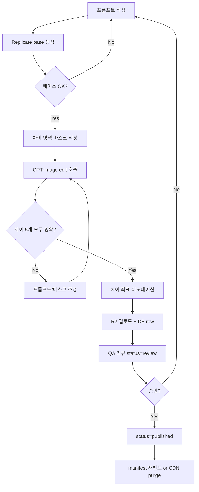

# 06. 이미지 생성 파이프라인

## 6.1 목표

- **베이스 이미지**: Replicate `z-image-turbo`, 1024x1024, 텍스트 프롬프트로 생성
- **변형 이미지**: GPT-Image 2.0 (OpenAI Images Edit API), 베이스 + 마스크 + 편집 프롬프트
- 두 이미지 사이에 **N개의 시각적 차이**를 의도적으로 만든다 (보통 5개)
- **런타임에는 절대 호출하지 않는다**. 어드민이 사전 생성 → 검수 → 게시.

## 6.2 전체 흐름



## 6.3 베이스 이미지 생성

### 호출 (서버 사이드, 어드민 백엔드)

```ts
// /admin/api/generate-base
import Replicate from "replicate";
const replicate = new Replicate({ auth: process.env.REPLICATE_API_TOKEN });

const output = await replicate.run(
  "lightricks/z-image-turbo:latest", // 실제 슬러그는 운영 시 픽스
  {
    input: {
      prompt,
      width: 1024,
      height: 1024,
      num_inference_steps: 8,
      guidance_scale: 1.0,
      output_format: "png"
    }
  }
);
```

> **메모**: 실제 모델 슬러그/파라미터는 Replicate 모델 페이지의 최신 스펙을 따른다. 모델이 deprecated되면 어드민 설정에서 슬러그를 교체할 수 있도록 환경 변수화.

### 프롬프트 가이드

- 정사각형 1024 캔버스 가정
- "centered subject, clean background, soft lighting, illustration style" 같이 차이 만들기 쉬운 구도를 유도
- 사람 얼굴 클로즈업은 피한다 (편집 시 잡티가 부각, 윤리 이슈 가능성)
- 텍스트는 안 만든다 ("no text, no letters")

### 결과 보관

- 베이스 PNG는 임시로 어드민의 R2 staging 경로에 저장 (`staging/{jobId}/base.png`)
- 검수 통과 후 `img/{contentId}/base.webp`로 이동 (포맷 변환)

## 6.4 변형 이미지 생성 (GPT-Image 2.0)

### Images Edit API

OpenAI는 `gpt-image-1` 계열에서 `images.edits` 엔드포인트를 제공한다. (정확한 모델명/버전은 출시 시점 기준 최신을 사용; 본 문서에서는 "GPT-Image 2.0"이라고 부른다.)

```ts
const result = await openai.images.edit({
  model: "gpt-image-2",       // 운영 시 실제 모델명으로
  image: baseFile,            // PNG
  mask: maskFile,             // 차이 영역만 alpha=0
  prompt: editPrompt,         // "make the cup handle disappear, add a small bird on the windowsill, ..."
  size: "1024x1024",
  n: 1
});
```

### 마스크 작성 두 가지 모드

1. **마스크 자동 생성 모드** (간단): 마스크 없이 전체 이미지를 주고 "subtle 5 differences" 같은 프롬프트로 변형. 결과 산포가 크고 좌표 추출이 어려움.
2. **마스크 수동 모드** (권장): 어드민 UI에서 베이스 위에 5개의 원/사각형을 그림 → 각 영역만 alpha 0인 마스크 PNG 생성 → 영역별로 짧은 편집 프롬프트 적용.
   - 더 안정적이고 차이 좌표를 *그대로* `differences`로 저장 가능.
   - 호출은 영역마다 한 번씩 직렬로 (또는 배치로 합쳐서 한 번).

### 차이 명세 형식 (어드민 입력)

```json
[
  { "idx": 1, "cx": 0.12, "cy": 0.34, "r": 0.06, "edit": "remove the cup handle" },
  { "idx": 2, "cx": 0.55, "cy": 0.20, "r": 0.05, "edit": "add a small bird" },
  { "idx": 3, "cx": 0.78, "cy": 0.62, "r": 0.07, "edit": "change book color to red" },
  { "idx": 4, "cx": 0.30, "cy": 0.80, "r": 0.05, "edit": "remove the leaf on the floor" },
  { "idx": 5, "cx": 0.50, "cy": 0.50, "r": 0.04, "edit": "make the clock hand point to 3" }
]
```

이 5개 항목이 그대로 `differences` 테이블 row가 된다. **즉, 어드민이 차이를 정의하면서 동시에 정답 좌표가 기록된다.** 추가 어노테이션 단계 없음.

## 6.5 후처리

| 단계 | 도구 | 결과 |
|------|------|------|
| PNG → WebP 변환 | `sharp` | base.webp, variant.webp |
| 썸네일 256px | `sharp` resize | base.preview.webp |
| 메타데이터 stripping | `sharp` | EXIF 제거 |
| 무결성 해시 | sha256 | manifest의 `etag`로 사용 (선택) |

## 6.6 비용 모델

가정: 콘텐츠 1세트당 Replicate 1회 + GPT-Image 5회 호출.

| 항목 | 단가 (가정) | 1세트 비용 |
|------|-------------|------------|
| Replicate z-image-turbo 1024² | ~$0.003 | $0.003 |
| GPT-Image edit 1024² | ~$0.04 | $0.20 |
| **합계** | | **~$0.20** |

월 100세트 추가 시 **$20 미만**. MVP의 30세트는 일회성 ~$6. 런타임 0.

> 실제 단가는 모델별로 자주 바뀐다. 어드민 대시보드에 "이번 달 누적 호출/예상 비용"을 노출해 천장을 만든다.

## 6.7 안전·품질 가드

- **프롬프트 화이트리스트**: 정치/혐오/성적 키워드 차단 사전 (어드민 입력 시 클라이언트/서버 양쪽 검사)
- **휴먼 검수 의무**: `status=review` 단계를 건너뛰고 published 직행 불가 (DB 트리거)
- **차이 검증 자동화**:
  - SSIM/PSNR로 베이스 vs 변형의 차이 영역이 "기대 범위 내"인지 검증
  - 차이가 너무 크면(전체가 다르면) 재생성 권유
- **저작권**: 모델 출력에 대한 라이선스/이용 약관은 어드민 가이드(11_maintenance.md)에 명시

## 6.8 재생성 정책

- 같은 콘텐츠 ID에 대해 이미지를 다시 만들면 **새 콘텐츠 ID로 만든다** (immutable URL 유지).
- 잘못된 콘텐츠는 `archived`로 내리고, 새 ID로 대체 게시.
- 이력은 `generation_jobs`에 남아 추적 가능.
