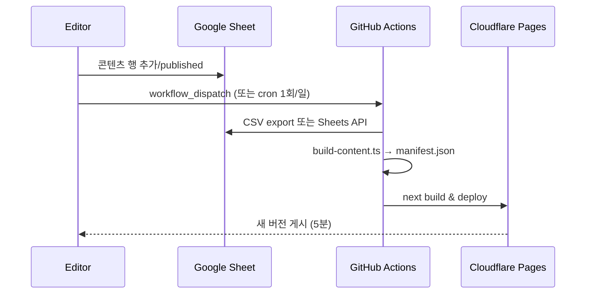
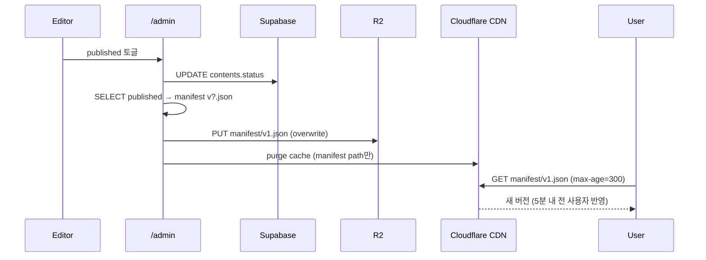

# 07. 콘텐츠 운영 (Spreadsheet → JSON → CDN)

## 7.1 운영 모델 한 줄

> "구글 스프레드시트가 진실, JSON이 배포 단위, CDN이 전송 채널, 클라이언트는 받아쓰기만."

이 프로젝트는 사용자가 만든 과거 패턴 — 스프레드시트를 JSON으로 굳혀 서버가 정적 배포 — 과 정확히 동일한 구조를 따른다. 차이점은 **이미지 메타까지 포함**한다는 것.

## 7.2 두 가지 운영 모드

### 모드 A: 빌드 기반 (기본)



- 장점: 빌드 산출물에 manifest가 박혀 있어 *원자적*. 이미지/manifest/코드 버전 동기.
- 단점: 콘텐츠 1개 추가에 5분 + GitHub Actions 분 소비.

### 모드 B: Remote Config (보조)



- 장점: 코드 변경 없이 콘텐츠 즉시 반영. 신고 들어온 콘텐츠 5분 내 내릴 수 있음.
- 단점: manifest와 클라이언트 코드의 schema 호환성을 사람이 책임. `schema` 필드로 가드.

> **추천**: 평소엔 모드 A. 긴급 콘텐츠 변경은 모드 B. 두 모드는 같은 manifest 포맷을 쓰므로 자연스럽게 공존한다.

## 7.3 스프레드시트 컬럼 정의

| 컬럼 | 타입 | 필수 | 설명 |
|------|------|------|------|
| slug | string | ✓ | URL-safe 식별자 (어드민용) |
| title | string | ✓ | 표시명 |
| prompt | string | ✓ | 베이스 이미지 프롬프트 |
| edit_prompt_json | json string |  | 차이별 편집 명세 (5건 배열) |
| difficulty | int | ✓ | 1~5 |
| time_limit_sec | int |  | 미입력 시 60 |
| tags | csv |  | "cozy,indoor" |
| status | enum | ✓ | draft/review/published/archived |
| notes | string |  | 어드민 메모 |

> 이미지 URL과 차이 좌표는 어드민 UI에서 시각적으로 정의해 DB에 저장한다. 스프레드시트에는 *메타* 정보만.

## 7.4 빌드 스크립트 책임

`scripts/build-content.ts` (TypeScript, Node 20)

1. Supabase에서 `status='published'`인 contents + differences를 fetch
2. 만일 스프레드시트 SoT 모드라면 Sheets API에서 데이터 추가 fetch
3. URL 정규화 (R2 베이스 경로 prefix)
4. 무결성 검사 (이미지 URL HEAD 요청, 모든 differences 좌표 ∈ [0,1])
5. `version` 필드는 빌드 시각 ISO 문자열
6. `/content/manifest.json` 작성
7. preview/썸네일이 없는 항목은 sharp로 즉석 생성

## 7.5 CDN 캐시 운용

- manifest.json: `Cache-Control: public, max-age=300, s-maxage=3600, stale-while-revalidate=86400`
  - 클라이언트는 5분, CDN은 1시간 캐시
  - 어드민이 "긴급 반영" 누르면 Cloudflare API로 해당 경로 purge
- 이미지: immutable. 경로(콘텐츠 ID) 자체가 버전이므로 purge 불필요.

## 7.6 클라이언트의 manifest 사용

```ts
// /lib/manifest.ts
export async function loadManifest(): Promise<Manifest> {
  const res = await fetch(MANIFEST_URL, {
    cache: 'force-cache',                     // 브라우저 캐시 활용
    next: { revalidate: 300 }                 // 빌드 시 ISR 힌트 (정적 export에선 무시)
  });
  if (!res.ok) throw new ManifestError(res.status);
  const data = await res.json();
  if (data.schema !== SUPPORTED_SCHEMA) {
    return loadFallbackManifest();            // 자체 번들된 백업 manifest
  }
  return data;
}
```

- 클라이언트는 **항상 백업 manifest를 코드에 번들**해서 갖고 있는다 (최후 fallback).
- `schema` mismatch / 네트워크 실패 시: "최신 콘텐츠를 불러오지 못했습니다. 새로고침해 주세요" 토스트 + 백업 manifest로 진행.

## 7.7 콘텐츠 추가 워크플로우 (목표 5분)

1. 어드민에 로그인 (1초)
2. "새 콘텐츠" → 프롬프트 입력 → "베이스 생성" (10~20초, Replicate)
3. 베이스 위에 차이 영역 5개 클릭 + 각 영역 편집 프롬프트 입력 (60~90초)
4. "변형 생성" (30~60초, GPT-Image)
5. 좌우 비교 미리보기 → "테스트 플레이" (30초)
6. "review → published" 토글, manifest 즉시 빌드 (CI에 트리거 또는 admin이 R2에 push) (30~60초)
7. 끝.

이 플로우가 5분을 못 지키면 **워크플로우가 망가진 것**으로 간주하고 리팩터.
