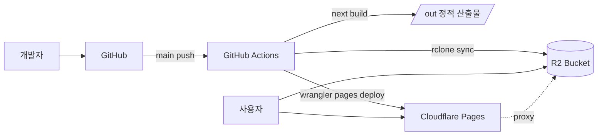

# 09. 배포

## 9.1 호스팅 토폴로지



## 9.2 Cloudflare 설정

### Pages

- 프로젝트: `twin-toast`
- 빌드 명령: `pnpm build` (Next.js static export)
- 산출물 디렉토리: `out`
- preview: 모든 PR 자동
- production branch: `main`
- custom domain: `twintoast.app` (Apex) + `www.twintoast.app` (CNAME → Pages)

### R2

- 버킷 2개: `twin-toast-prod`, `twin-toast-dev`
- 공개 도메인: `cdn.twintoast.app` → R2 prod 버킷에 바인딩 (Cloudflare R2 custom domain)
- CORS: `GET` from `https://twintoast.app`, `https://*.pages.dev`
- 라이프사이클: `staging/*` 7일 후 자동 삭제

### 캐시 규칙 (Cloudflare Page Rules / Cache Rules)

| 패턴 | 정책 |
|------|------|
| `/img/*` | Cache Everything, Edge TTL 1 month, Origin TTL respect |
| `/manifest/*.json` | Cache Everything, Edge TTL 1 hour |
| `/config.json` | Cache Everything, Edge TTL 5 min |
| `/_next/static/*` | Cache Everything, immutable |
| `/admin/*` | Bypass cache |

### Workers/Functions (선택)

- 어드민의 이미지 생성 트리거를 Cloudflare Workers에 두면 키 관리가 깔끔하지만 MVP는 Pages Functions 또는 Supabase Edge Functions로 충분.
- 게임 클라이언트는 Workers를 거치지 않는다 (정적 자산만).

## 9.3 GitHub Actions

### 워크플로우 1: PR Preview

```yaml
# .github/workflows/preview.yml (개요)
on: pull_request
jobs:
  build-preview:
    runs-on: ubuntu-latest
    steps:
      - uses: actions/checkout@v4
      - uses: pnpm/action-setup@v4
      - uses: actions/setup-node@v4
        with: { node-version: 20, cache: pnpm }
      - run: pnpm install --frozen-lockfile
      - run: pnpm build:content   # Supabase staging에서 manifest 생성
        env:
          SUPABASE_URL: ${{ secrets.SUPABASE_URL_STAGING }}
          SUPABASE_SERVICE_ROLE_KEY: ${{ secrets.SUPABASE_SR_STAGING }}
      - run: pnpm build           # next build (static export)
      - uses: cloudflare/pages-action@v1
        with:
          apiToken: ${{ secrets.CLOUDFLARE_API_TOKEN }}
          accountId: ${{ secrets.CLOUDFLARE_ACCOUNT_ID }}
          projectName: twin-toast
          directory: out
```

### 워크플로우 2: Production

- `on: push: branches: [main]`
- `SUPABASE_URL`/`SUPABASE_SERVICE_ROLE_KEY`는 production secret
- 배포 후 `manifest.json`을 R2에도 sync (rclone) — 이중화

### 워크플로우 3: 스케줄 빌드

- `cron: '0 */6 * * *'` (6시간마다) — 어드민이 published 토글한 후 늦어도 6시간 안에는 빌드 반영
- 모드 B(Remote Config)로 즉시 반영하면 이 워크플로우는 안전망 역할

## 9.4 도메인/SSL

- 도메인: `twintoast.app` (예시, 실제는 사용자가 결정)
- DNS: Cloudflare. Apex는 CNAME flattening 사용
- SSL: Cloudflare Universal SSL (자동)
- HSTS: 6개월, includeSubDomains, preload (안정 후)

## 9.5 배포 체크리스트 (Production)

- [ ] `next build`가 경고 없이 통과
- [ ] manifest.json schema 검증 통과
- [ ] 모든 이미지 URL HEAD 200
- [ ] Lighthouse 모바일 성능 ≥ 85
- [ ] Playwright smoke 테스트 통과 (홈 → 라운드 → 결과)
- [ ] 환경 변수 `NEXT_PUBLIC_*`만 클라이언트 번들에 포함됨
- [ ] Cloudflare Web Analytics 스크립트 활성

## 9.6 롤백

- Pages는 이전 deploy로 1클릭 롤백 (Cloudflare 대시보드)
- manifest는 R2 객체에 `manifest/v1.json`만 두지 말고 `manifest/v1-{date}.json`도 함께 보관 → 긴급 롤백 시 alias만 교체
- DB 롤백은 발생 안 함을 목표 (status 토글만으로 콘텐츠 제어)

## 9.7 비용 추정 (월)

| 항목 | 가정 | 비용 |
|------|------|------|
| Cloudflare Pages | 무료 (Free tier) | $0 |
| Cloudflare R2 | < 10GB 저장, < 1M class A ops | $0 ~ $1 |
| Supabase | Free 또는 Pro $25 | $0 ~ $25 |
| 도메인 | $10/년 | < $1 |
| Replicate / OpenAI | 사전 생성, 월 +50세트 | < $15 |
| **합계** | | **< $30 ~ $42** |
