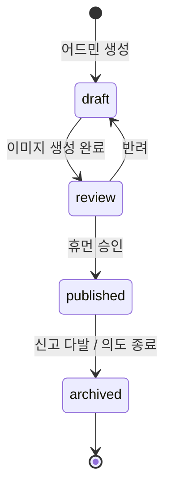

# 11. 유지 보수 & 운영

## 11.1 일상 운영 루틴

| 빈도 | 작업 | 도구 |
|------|------|------|
| 매일 | 신고 큐 확인, 긴급 차단 | /admin/reports |
| 매일 | Cloudflare 분석에서 이상 트래픽 확인 | CF Web Analytics |
| 주 1회 | 새 콘텐츠 N개 생성 → 검수 → 게시 | /admin/contents/new |
| 주 1회 | 비용 대시보드 확인 | /admin (Replicate + OpenAI) |
| 월 1회 | 의존성 업데이트, security advisory 확인 | dependabot, `pnpm audit` |
| 분기 1회 | 만료된 콘텐츠 archive, manifest 슬림화 | /admin |

## 11.2 모니터링

### 가시성

- **Cloudflare Web Analytics**: 트래픽, 페이지뷰, 코어 웹 바이탈. 쿠키리스. 무료.
- **Sentry (선택)**: 클라이언트 JS 에러. 어드민에서만 활성하고 게임 클라이언트는 *민감 정보 0*이므로 비활성도 가능.
- **Supabase Logs**: DB/Auth 로그. 어드민이 비정상 로그인 시도 등을 감시.
- **R2 메트릭**: Class A/B 호출 수, egress (free) 측정.

### 알림

- Cloudflare 트래픽 스파이크: 평소 대비 5x → Slack/이메일
- Supabase 에러율 5% 초과 → 알림
- Replicate/OpenAI 월 사용량 80% 도달 → 알림 + 어드민 게시 일시 중단

### 메트릭 수집 (선택, 클라 사이드)

게임 KPI(라운드 시작/완주/실패) 수집은 다음 방식 중 택1:

1. **Cloudflare Web Analytics 커스텀 이벤트** — `pa.track('round_finished', { ok: true, t: 32 })`. 쿠키리스 유지.
2. **Plausible / Umami** — 자체 호스팅 시 R2 + Worker로 비싸지지 않음.
3. **수집 안 함** — MVP는 이걸로도 충분.

## 11.3 콘텐츠 라이프사이클

- `published`만 manifest에 포함된다.
- `archived`는 DB에 남기되 manifest에서 제외 (이미지 R2 객체는 보존, immutable 원칙).
- 신고 임계 (예: 5건 이상) 도달 시 자동으로 `review`로 강등하는 SQL 함수 + cron 검토.

## 11.4 신고 처리 운영

1. 신고가 들어오면 `reports` row 생성 (anon insert RLS)
2. `client_hash` = sha256(IP + UA + content_id) 같은 가벼운 dedup 키 — 같은 사람의 중복 신고 1건으로 카운트
3. 신고 5건 이상 → 자동 강등 (별도 cron worker, 5분 주기)
4. 어드민이 큐에서 1클릭으로 `archived` or `keep`
5. 어드민이 무시하지 않고 결정한 신고는 `resolved` 표시

## 11.5 콘텐츠 다양성 유지

- "최근 30일 내 만든 콘텐츠 X개" 카드를 어드민 대시보드에 띄움
- tags 분포 모니터링 (실내/야외, 음식/풍경 등)
- 같은 주제가 4세트 이상 누적 시 경고

## 11.6 비용 관리

| 통제 | 방법 |
|------|------|
| Replicate 월 한도 | 어드민 대시보드에 누적 호출 수, 한도 도달 시 게시 비활성 |
| OpenAI 월 한도 | 동일 |
| R2 저장량 | 콘텐츠 1세트 = ~600KB (1024² webp ×2 + 썸네일). 1000세트 ≈ 600MB. |
| Pages bandwidth | 무료 무제한. |
| Supabase | DAU별로 거의 사용량 0. Free tier로 시작. |

월 비용 천장: $50로 자체 설정. 초과 신호가 잡히면 어드민 콘솔에서 게시 동결.

## 11.7 보안

- `.env*` 파일은 절대 커밋 금지 (`.gitignore` + pre-commit hook + GitHub secret scanning)
- Supabase service_role 키는 GitHub Actions secret에만, 클라이언트 절대 접근 안 함
- Replicate/OpenAI 키도 동일
- 어드민 라우트는 미들웨어에서 매 요청 인증
- 의존성 자동 업데이트 (Dependabot, weekly)
- CSP (Content Security Policy): self + cdn 도메인 + cf analytics만. inline script 금지(필요 시 nonce).
- 게임 클라이언트는 외부 도메인으로의 fetch 0 (manifest, 이미지, sfx만)

## 11.8 재해 복구

| 시나리오 | 대응 |
|----------|------|
| Cloudflare Pages 장애 | Vercel/Netlify에 백업 deploy 준비 (수동, 5~10분) |
| R2 장애 | 이미지/manifest를 GitHub Pages 미러 보유 (정기 sync) |
| Supabase 장애 | 게임은 manifest로만 돌아가므로 영향 없음. 어드민만 마비 |
| 도메인/DNS 사고 | Pages.dev 기본 도메인으로 우회 |
| 콘텐츠 대량 삭제 사고 | DB는 PITR 7일. R2는 객체 immutable이라 살아있음. SQL로 status 복구 |

## 11.9 라이선스/정책

- 이미지 모델 결과물 라이선스 명시 (개발자가 모델 약관 점검 필요)
- 게임 푸터에 "AI 생성 이미지" 고지
- 사용자 데이터 수집 0임을 `/about` 페이지에 명시 (개인정보처리방침 대신)
- 신고 → 처리 SLA 명시 (예: 24시간 내 검토)

## 11.10 사용자 피드백 채널

- 푸터에 "피드백 보내기" 메일 링크 (`mailto:`) — 폼 백엔드 만들지 않음
- 게임 내 신고 버튼은 콘텐츠 단위로만
