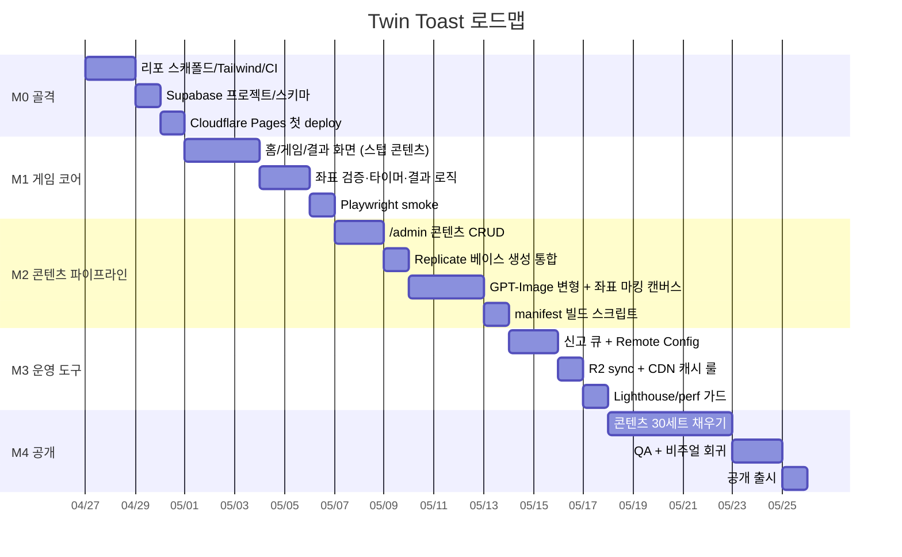

# 12. 로드맵

## 12.1 마일스톤

## 12.2 마일스톤 별 완료 기준

### M0 — 골격 (기간 ~4일)

- `/Users/izowooi/git/jolly-jelly/twin-toast`에 Next.js + Tailwind 보일러플레이트
- pnpm workspace, ESLint/Prettier, Vitest, Playwright 설치
- GitHub Actions: PR preview / main → Cloudflare Pages
- Supabase 프로젝트 생성, 스키마 마이그레이션 적용
- 빈 홈 화면이 `cdn.twintoast.app`(또는 임시 도메인)에 떠있다

### M1 — 게임 코어 (기간 ~6일)

- 홈에 "랜덤 시작" 버튼이 있고, 누르면 *번들된 스텁 manifest* 로드
- 좌우 이미지가 보이고, 5개 차이 영역을 클릭으로 찾을 수 있음
- 타이머 60초 카운트다운, 0이 되면 실패 화면
- 모바일/데스크톱 두 뷰포트에서 동작
- Playwright smoke + happy-path 통과
- **공개되어 있더라도 콘텐츠는 1~3세트만**

### M2 — 콘텐츠 파이프라인 (기간 ~7일)

- 어드민 로그인, 콘텐츠 목록/생성/편집
- 베이스 이미지 Replicate 호출 → 미리보기
- 캔버스에서 차이 5개 마킹 + 영역별 편집 프롬프트
- GPT-Image 호출 → 변형 미리보기 → 좌우 비교
- 게시 토글
- `pnpm build:content`로 manifest.json 생성, 이미지 R2 sync

### M3 — 운영 도구 (기간 ~4일)

- 신고 큐, archive 액션
- Remote Config(`config.json`) 편집 화면
- 비용 카운터 (Replicate/OpenAI 월 누적)
- 캐시 정책 적용 + Cloudflare cache rules
- Lighthouse CI에서 모바일 ≥ 85

### M4 — 공개 (기간 ~8일)

- 30세트 콘텐츠 적재 (페이스 5/일)
- 휴먼 QA 통과 100%
- 시각 회귀 테스트 베이스라인 확정
- 도메인 연결, HSTS preload는 *공개 후 2주 후*
- About 페이지 + 데이터 수집 0 고지

## 12.3 우선순위 매트릭스

| 작업 | 가치 | 비용 | 우선순위 |
|------|------|------|----------|
| 게임 코어 5분 플레이 | 매우 높음 | 중 | P0 |
| 좌표 검증 정확성 | 매우 높음 | 낮음 | P0 |
| 어드민 콘텐츠 CRUD | 높음 | 중 | P0 |
| Replicate/GPT-Image 통합 | 높음 | 중 | P1 |
| Remote Config | 중 | 낮음 | P1 |
| 시각 회귀 테스트 | 중 | 중 | P2 |
| Sentry/메트릭 수집 | 낮음 | 낮음 | P2 |
| 다국어 | 낮음 | 높음 | 보류 |
| PWA | 낮음 | 높음 | 보류 |
| 멀티플레이 | 낮음 | 매우 높음 | 보류 |

## 12.4 향후 (MVP 이후) 아이디어

- **데일리 챌린지**: 매일 0시 KST에 "오늘의 그림" 1세트 강제 (manifest의 `daily` 필드 + 클라 시계)
- **힌트 시스템**: 시간 -5초 차감하고 위치 힌트 표시
- **연속 플레이 모드**: 라운드 끊김 없이 N개를 연속으로
- **콘텐츠 리믹스**: 사용자가 좋아한 콘텐츠 태그 기반 추천 (단, 데이터 0 원칙은 유지)
- **사용자 제작 콘텐츠**: 모델 호출 비용 부담 때문에 보류, 검수 비용도 큼
- **공유 기능**: 라운드 결과를 이미지로 만들어 공유 (Open Graph)
- **국제화**: ko → en → ja 순으로

## 12.5 측정 가능한 출시 기준

- [ ] 누적 30세트 published
- [ ] 모바일 Lighthouse 성능 ≥ 85, 접근성 ≥ 90
- [ ] Playwright E2E 10개 시나리오 모두 통과
- [ ] 어드민이 새 콘텐츠 1세트를 5분 내에 게시 가능
- [ ] 비용 시뮬레이션상 1만 DAU에서 월 < $50
- [ ] 신고-처리 워크플로우가 5분 내 동작
